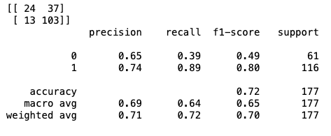
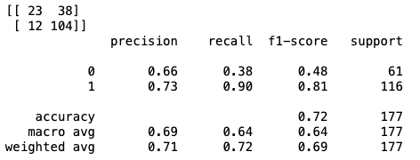
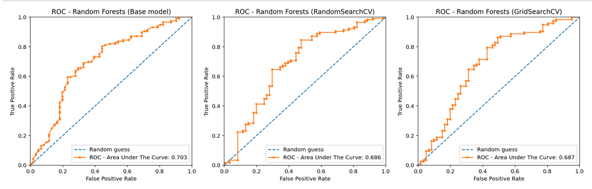

# About the Project
The goal of the project was to automate the loan elibility process for home buyer using customers online application forms. The details used are Gender, Marital Status, Education, Number of Dependents, Income, Loan Amount, Credit History and more. 

## Steps and Results:
1. Preprocessing Dataset
2. Model Selection (Random Forest Classification)
3. Train Model
4. Check prediction on test data
5. Check Feature Importance
6. Implement Hypter-Parameters (GridSearchCV & RandomizedSearchCV)
7. Classification Report
8. ROC Curves

Results:
Accuracy Score (Before Hyper-Parameters): 69%
Accuaracy Score (After Hypter-Parameters): 72%

# Confusion Matrix and Classification Report (Before Hyper-Parameters)

# Confusion Matrix and Classification Report (After Hyper-Parameters)

# ROC Curves

# Technologies
* Python
  * scikit-learn
  * Pandas
  * Numpy

